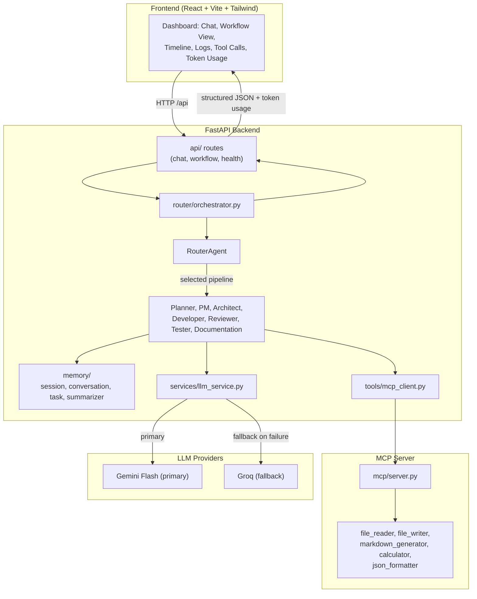
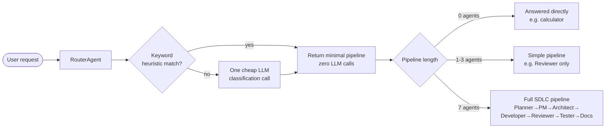
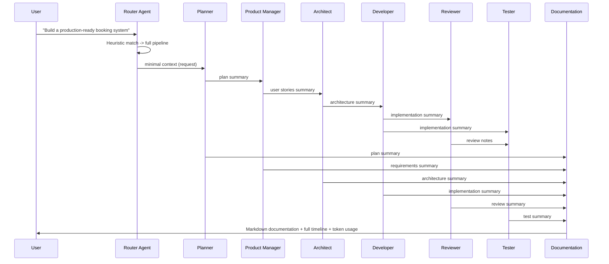
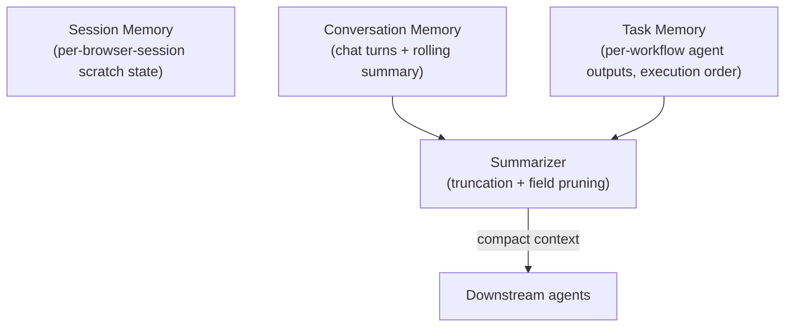

# Architecture

## 1. System overview

```mermaid
flowchart TB
    subgraph Client["Frontend (React + Vite + Tailwind)"]
        UI[Dashboard: Chat, Workflow View,\nTimeline, Logs, Tool Calls, Token Usage]
    end

    subgraph API["FastAPI Backend"]
        Routes["api/ routes\n(chat, workflow, health)"]
        Orchestrator["router/orchestrator.py"]
        Router["RouterAgent"]
        Agents["Planner, PM, Architect,\nDeveloper, Reviewer, Tester, Documentation"]
        Memory["memory/\nsession, conversation, task, summarizer"]
        LLMService["services/llm_service.py"]
        MCPClient["tools/mcp_client.py"]
    end

    subgraph MCP["MCP Server"]
        MCPServer["mcp/server.py"]
        Tools["file_reader, file_writer,\nmarkdown_generator, calculator,\njson_formatter"]
    end

    subgraph LLMs["LLM Providers"]
        Gemini["Gemini Flash (primary)"]
        Groq["Groq (fallback)"]
    end

    UI -->|HTTP /api| Routes
    Routes --> Orchestrator
    Orchestrator --> Router
    Router -->|selected pipeline| Agents
    Agents --> Memory
    Agents --> LLMService
    Agents --> MCPClient
    MCPClient --> MCPServer
    MCPServer --> Tools
    LLMService -->|primary| Gemini
    LLMService -->|fallback on failure| Groq
    Orchestrator --> Routes
    Routes -->|structured JSON + token usage| UI
```

## 2. Router decision flow (lazy agent execution)

```mermaid
flowchart LR
    Start([User request]) --> Router[RouterAgent]
    Router --> Heuristic{Keyword\nheuristic match?}
    Heuristic -- yes --> Pipeline[Return minimal pipeline\nzero LLM calls]
    Heuristic -- no --> LLMCall[One cheap LLM\nclassification call]
    LLMCall --> Pipeline
    Pipeline --> Decision{Pipeline length}
    Decision -- "0 agents" --> Direct[Answered directly\ne.g. calculator]
    Decision -- "1-3 agents" --> Simple[Simple pipeline\ne.g. Reviewer only]
    Decision -- "7 agents" --> Full[Full SDLC pipeline\nPlanner→PM→Architect→\nDeveloper→Reviewer→Tester→Docs]
```

## 3. Full SDLC agent pipeline (complex request)

```mermaid
sequenceDiagram
    participant U as User
    participant R as Router Agent
    participant P as Planner
    participant PM as Product Manager
    participant A as Architect
    participant D as Developer
    participant Rv as Reviewer
    participant T as Tester
    participant Doc as Documentation

    U->>R: "Build a production-ready booking system"
    R->>R: Heuristic match -> full pipeline
    R->>P: minimal context (request)
    P->>PM: plan summary
    PM->>A: user stories summary
    A->>D: architecture summary
    D->>Rv: implementation summary
    D->>T: implementation summary
    Rv->>T: review notes
    P->>Doc: plan summary
    PM->>Doc: requirements summary
    A->>Doc: architecture summary
    D->>Doc: implementation summary
    Rv->>Doc: review summary
    T->>Doc: test summary
    Doc->>U: Markdown documentation + full timeline + token usage
```

## 4. Memory model

```mermaid
flowchart TB
    SM["Session Memory\n(per-browser-session scratch state)"]
    CM["Conversation Memory\n(chat turns + rolling summary)"]
    TM["Task Memory\n(per-workflow agent outputs, execution order)"]
    Sum["Summarizer\n(truncation + field pruning)"]

    CM --> Sum
    TM --> Sum
    Sum -->|compact context| Agents["Downstream agents"]
```
