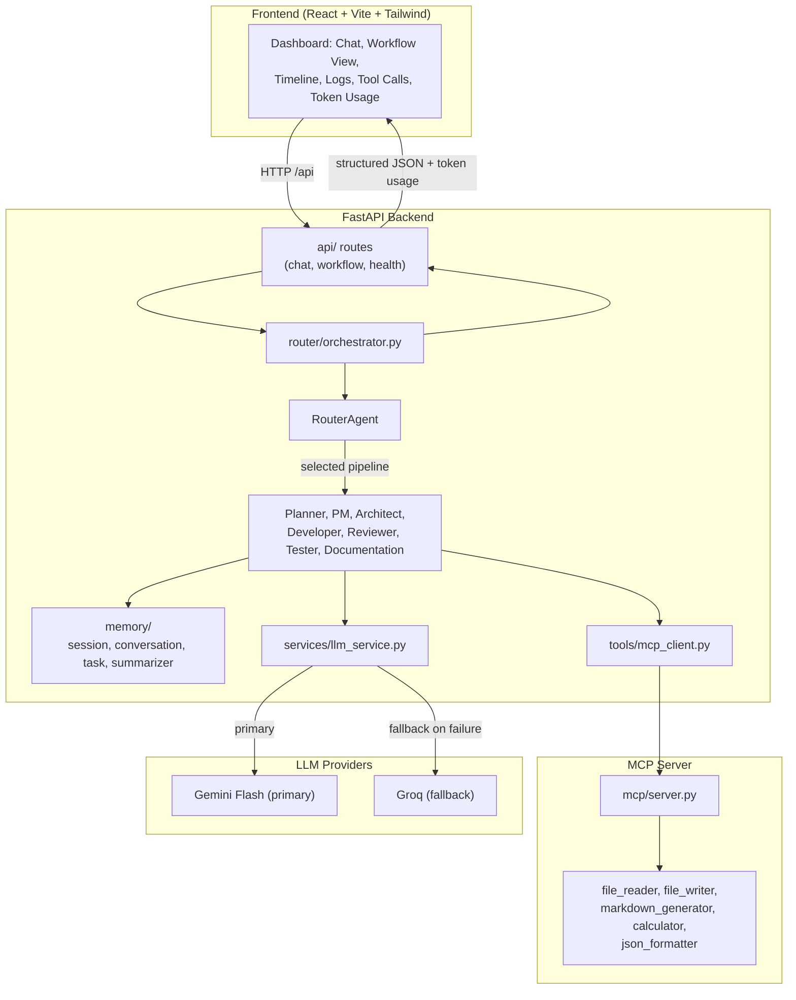
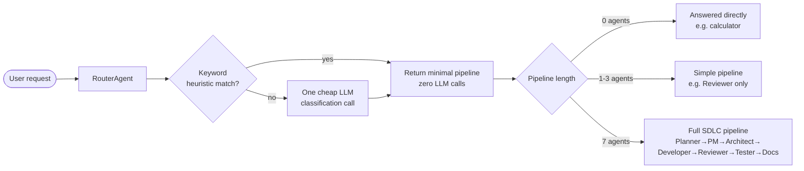
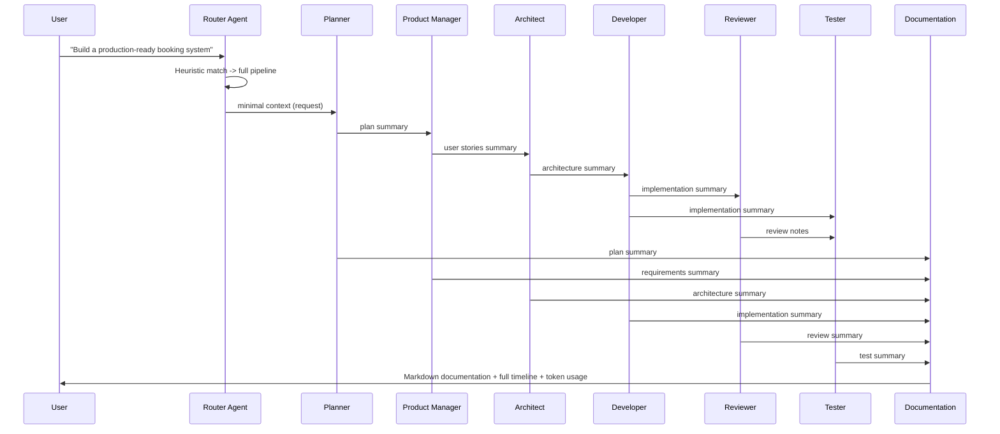
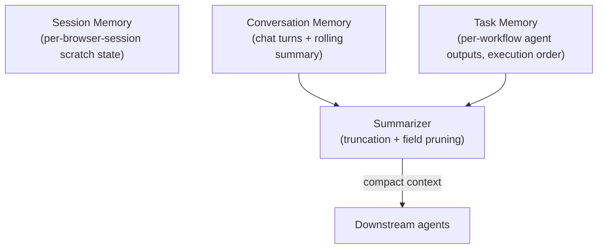

# AI Agent Platform — Phase 1 Foundation

**Kaggle AI Agents: Intensive Vibe Coding Capstone — Agents for Business**

FlowForge AI is an intelligent multi-agent platform that orchestrates the entire Software Development Lifecycle—from planning and architecture to implementation, testing, and documentation—using specialized AI agents, intelligent routing, and MCP-powered tools while optimizing for free-tier LLMs.

## Problem Statement

Modern software development involves multiple specialized roles such as planning, requirement analysis, architecture design, implementation, testing, code review, and documentation. Existing AI coding assistants typically rely on a single large language model to perform all these responsibilities, resulting in longer prompts, higher token consumption, and limited modularity.

This project addresses that challenge by building a production-oriented multi-agent Software Development Lifecycle (SDLC) platform where specialized AI agents collaborate through structured workflows. Each agent focuses on a single responsibility, enabling better scalability, improved maintainability, lower token usage, and clearer execution pipelines.

## Why Multi-Agent Systems?

Software development is naturally collaborative, involving multiple specialized roles. Instead of relying on one general-purpose LLM, this platform divides the workflow into dedicated AI agents:

- Router selects only the required agents.
- Planner creates the execution strategy.
- Product Manager generates user requirements.
- Architect designs the system.
- Developer produces the implementation.
- Reviewer validates quality.
- Tester generates testing plans.
- Documentation creates project documentation.

Each agent performs exactly one LLM call and receives only summarized context from upstream agents, reducing token usage while improving modularity, explainability, and scalability.

# Key Features

- **Router-first, lazy execution.** Every request goes through the `RouterAgent`, which uses
  free keyword heuristics (zero LLM cost) and only escalates to a single cheap LLM
  classification call when the request is ambiguous. Most requests never trigger the full
  7-agent SDLC pipeline.
- **One LLM call per agent, minimal context.** Agents never receive the full conversation —
  only a summarized slice of the upstream agent's output they depend on
  (`memory/summarizer.py`).
- **MCP-only tool access.** Agents call tools exclusively through `tools/mcp_client.py`,
  which talks to the in-process `mcp/server.py` registry. This keeps the contract identical
  to a real networked MCP server, so Phase 2 can swap it in without touching agent code.
- **Gemini primary / Groq fallback.** `services/llm_service.py` is the single call site for
  all LLM traffic: it tries Gemini Flash first, falls back to Groq on failure, caches
  identical calls, and records token usage per task.

# Architecture

## 1. System overview



## 2. Router decision flow (lazy agent execution)



## 3. Full SDLC agent pipeline (complex request)



## 4. Memory model


## Multi-agent pipeline

| Agent | Responsibility | MCP tools it may use |
|---|---|---|
| Router | Decide which agents run | json_formatter |
| Planner | High-level task plan | json_formatter |
| Product Manager | User stories & acceptance criteria | json_formatter |
| Architect | System/component design | json_formatter |
| Developer | Implementation | file_writer, json_formatter |
| Reviewer | Code review feedback | json_formatter |
| Tester | Test case generation | calculator, json_formatter |
| Documentation | Final Markdown docs | markdown_generator, file_writer, json_formatter |

**Complex request** ("Build a production-ready booking system"):
`Router → Planner → PM → Architect → Developer → Reviewer → Tester → Documentation`

**Simple request** ("Review my code"): `Router → Reviewer`

**Trivial request** ("What is 12 * 4?"): `Router` only — answered without spinning up any downstream agent.

## Folder structure

```
ai-agent-platform/
├── backend/
│   ├── agents/        # One file per agent (router, planner, pm, architect, developer,
│   │                  # reviewer, tester, documentation) — each returns structured JSON
│   ├── router/         # Orchestrator that executes the pipeline the RouterAgent chose
│   ├── tools/          # MCP client — the only sanctioned path from agents to tools
│   ├── mcp/             # MCP server + 5 tools (file_reader, file_writer, markdown_generator,
│   │                    #   calculator, json_formatter)
│   ├── memory/          # Session / conversation / task memory + summarizer
│   ├── api/              # FastAPI routes (chat, workflow, health) + Pydantic schemas
│   ├── services/         # llm_service, gemini/groq providers, token_tracker, cache_service
│   ├── config/           # settings.py (env-driven), logging_config.py
│   ├── tests/            # pytest unit tests for router, MCP tools, memory
│   ├── .env.example
│   ├── requirements.txt
│   └── Dockerfile
├── frontend/
│   ├── src/
│   │   ├── pages/Dashboard.jsx
│   │   ├── components/   # ChatPanel, WorkflowVisualization, AgentTimeline,
│   │   │                 # ActiveAgentBadge, LogsPanel, ToolCallsPanel, TokenUsagePanel
│   │   ├── hooks/         # useChat, useWorkflow
│   │   └── services/api.js
│   ├── .env.example
│   └── Dockerfile
├── docker-compose.yml
├── ARCHITECTURE.md        # Mermaid diagrams
└── README.md
```

# Demo

The platform provides an interactive dashboard that enables users to monitor the complete AI-powered Software Development Lifecycle in real time. Every execution is observable through workflow visualization, generated artifacts, execution logs, and token usage metrics.

## Dashboard

The dashboard serves as the primary interface where users submit software development requests, monitor execution progress, and view overall workflow status together with token usage statistics.

> **Screenshot:** `
`

---

## Workflow Visualization

The workflow view illustrates the execution pipeline selected by the Router Agent. Based on the complexity of the request, only the required agents are executed, demonstrating intelligent routing and token-efficient orchestration.

> **Screenshot:** `
`

---

## Generated Artifacts

Each completed workflow produces reusable artifacts such as project plans, requirements, architecture summaries, implementation outputs, testing plans, review reports, and final documentation that can be viewed directly from the dashboard.

> **Screenshot:** `'


---

## Execution Logs

The logs panel provides detailed runtime information including agent execution events, MCP tool invocations, provider switching, retries, and debugging information, enabling complete observability of the workflow.

> **Screenshot:** `
`

## Getting started

### Backend

```bash
cd backend
cp .env.example .env      # fill in GEMINI_API_KEY / GROQ_API_KEY
pip install -r requirements.txt
uvicorn backend.main:app --reload --port 8000
```

Run tests:

```bash
cd backend
pytest tests/ -v
```

### Frontend

```bash
cd frontend
cp .env.example .env
npm install
npm run dev
```

### Docker (both services)

```bash
cp backend/.env.example backend/.env   # fill in real keys first
docker compose up --build
```

- Backend: http://localhost:8000 (docs at `/docs`)
- Frontend dashboard: http://localhost:5173

## Token optimization strategies implemented

- Lazy agent execution (Router skips unnecessary agents)
- Rule-based routing before any LLM call
- Response caching (`services/cache_service.py`)
- Per-task token budgeting & usage reporting (`services/token_tracker.py`)
- Context summarization instead of full-history passing (`memory/summarizer.py`)
- Shared structured JSON between agents (`memory/task_memory.py`)
- Exactly one LLM call per agent invocation

## Security

- All secrets via environment variables (`.env`, never committed — see `.gitignore`)
- Pydantic-validated request schemas (`api/schemas.py`)
- Sandboxed MCP file tools (path traversal blocked, restricted to `MCP_WORKSPACE_DIR`)
- Calculator tool uses a safe AST-based evaluator (no `eval`)
- Structured JSON logging (`config/logging_config.py`)
- Global FastAPI exception handler (no stack traces leaked to clients)

## Results

The platform successfully demonstrates:

- Intelligent agent routing
- Multi-agent collaboration
- Token-efficient execution
- MCP tool orchestration
- Automatic artifact generation
- Live workflow visualization
- LLM provider fallback
- Production-ready modular architecture
  ---

# Future Work

- Persistent memory
- Parallel agent execution
- Human approval checkpoints
- Distributed MCP Server
- RAG integration
- Agent evaluation framework

---

# License

MIT License.


